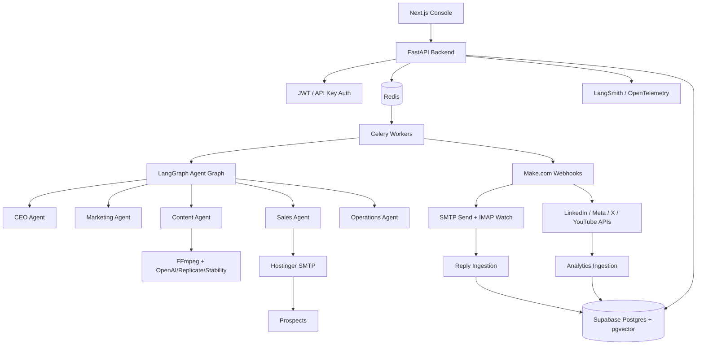

# Autonomous AI Company Operating System

A production-oriented monorepo for an autonomous AI company team: CEO orchestration, marketing intelligence, content/reel generation, sales outreach, approval gates, queue workers, secure Make.com execution, CRM memory, analytics, and operations monitoring.

## Architecture



Make.com is intentionally an execution layer only. Intelligence, approval, risk scoring, memory, and policy enforcement live in the backend and agent graph.

## Folder Structure

```text
apps/
  api/                 FastAPI app, agent graph, queues, integrations
  web/                 Next.js + Tailwind + shadcn-ready operator console
infra/
  docker-compose.yml   Local Postgres/Redis/API/worker stack
  supabase/schema.sql  Production Supabase schema with pgvector
  make/scenarios.md    Make.com scenario contracts
scripts/
  smoke_test.sh        Local validation helper
```

## Daily Automation Flow

1. `/api/v1/runs/daily` queues the daily operating cycle.
2. Marketing and Sales agents collect trend/lead intelligence.
3. Content agent creates platform-specific assets and reel jobs.
4. CEO agent evaluates quality and business fit.
5. Operations agent validates rate limits, duplicate risk, spam risk, compliance, and platform safety.
6. Approved actions enter `approval_items` and optional human review.
7. Executable actions are dispatched to Make.com webhooks or direct backend integrations.
8. Analytics/replies are ingested, embedded, and used to optimize future strategy.

## Production Setup

1. Create Supabase project and run `infra/supabase/schema.sql`.
2. Provision Redis on Railway/Render.
3. Deploy `apps/api` to Railway/Render.
4. Deploy `apps/web` to Vercel.
5. Add secrets from `.env.example` to platform secret stores.
6. Configure Make.com scenarios from `infra/make/scenarios.md`.
7. Configure DNS: SPF, DKIM, and DMARC (`v=DMARC1; p=quarantine; pct=100;`).

## Security Model

- Secrets are backend-only environment variables.
- Webhooks use HMAC SHA-256 verification.
- Rate limits and anti-ban policies are enforced before execution.
- Every proposed/executed action is audit logged.
- CEO approval is mandatory before outbound publishing or outreach.
- Human approval can be required per workspace/policy.
